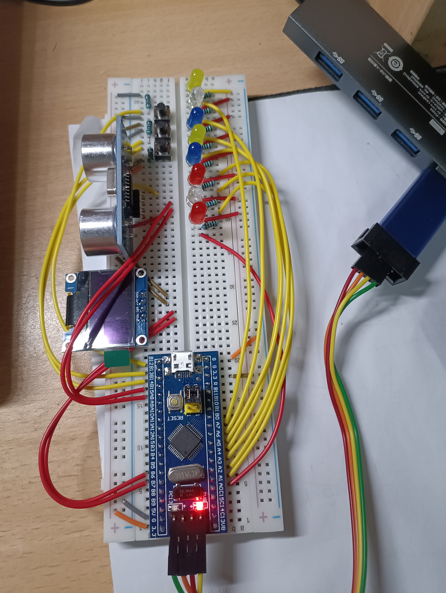

# 单片机灯任务（IO口 按键）
## 任务1

从左到右，依次亮灯，间隔1s，然后从右到左依次亮灯（循环）。

## 任务2

加入按键模块，实现下面两个功能
按下键1，led全亮，再按一次，led全暗
按下键2，led运行流水灯

## 任务3

将灯亮视为1，灯暗视为0，运用二进制使八颗灯(0~255)显示斐波那契数列
如：0000 0001表示1 
0000 0010表示2

## 任务4

学习了解PWM（Pulse Width Modulation）简称脉宽调制，利用PWM制作呼吸灯。

## 任务5

使用按键操作实现可控亮度LED灯（长按按键一led逐渐变量，长按按键二led逐渐变暗）

***

注：若对于亮灯有其他更有创意的想法也可自行实现

***
***
## 代码介绍
以上为本次单片机任务的内容，以下为我的代码解决方案的介绍：\
本次代码基于**STM32F103C8T6**单片机，单片机的部分IO口配置是PA0-PA7是LED0-LED8，输出模式，初始电位是高电平,PB12-PB14是KEY0-KEY2,输入模式，其他IO口的配置可以打开**STM32CubeMX**生成的.**ioc**文件查看，使用STM32CubeMX生成配置文件，通过**Hal**库编程，使用**Clion**编译和烧录。
电路板图片如下：

<div  align="center">    



</div>

所有任务均在这个代码里面实现，具体切换在**main.h**中的宏定义用户代码块：
```c
/* USER CODE BEGIN Private defines */
//#define TASK1
#define TASK2
//#define TASK3
//#define TASK4
//#define TASK5
/* USER CODE END Private defines */
```
如果想要切换成对应的任务的代码，只需要将对应任务前面的注释去掉，并把其他任务注释掉即可。\
演示如下：\
任务1

任务2
\
任务3

任务4
\
任务5
\
维护人：袁汉阔\
邮箱：yuanhankuo@qq.com
